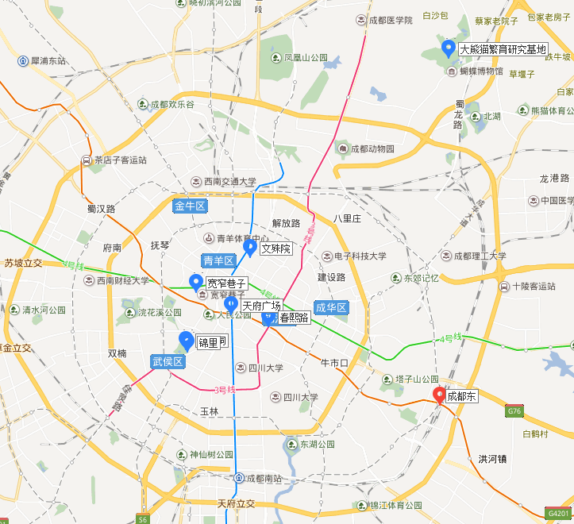

# 成都
重庆成都靠得比较近，所以就一块儿去了。

## 交通
### 地图

### 往返程
出发时间 | 出发地 | 抵达时间 | 目的地 | 备注
---- | --- | --- | --- | ---
2017-8-20 17:35 | 南京 禄口机场T2 | 2017-8-20 19:55 | 重庆 [江北机场T2A](http://j.map.baidu.com/Q8grk) | 中国东方航空MU2845
2017-8-23 14:04 | 重庆 [重庆北](http://j.map.baidu.com/d9zvM) | 2017-8-23 15:45 | 成都 [成都东](http://j.map.baidu.com/w2LTC) | G8526
2017-8-25 12:50 | 成都 [成都东](http://j.map.baidu.com/w2LTC) | 2017-8-25 14:30 | 重庆 [重庆北](http://j.map.baidu.com/d9zvM) | G8515
2017-8-25 17:05 | 重庆 [江北机场T2B](http://j.map.baidu.com/Q8grk) | 2017-8-25 19:10 | 南京 禄口机场T2 | 西部航空PN6201
### 市内交通
地铁首末班车时间基本都是06:30-22:30

## 行程
### 时间安排
|    | 8-23 | 8-24  | 8-25
:--: | :--: | :---: | :---: 
上午 | -    | [大熊猫繁育研究基地](http://j.map.baidu.com/9QmGk) | [文殊院](http://j.map.baidu.com/IWhkl)
下午 | 抵达 | [春熙路](http://j.map.baidu.com/f559F) | 返回重庆 
晚上 | [武侯祠/锦里](http://j.map.baidu.com/DiX8k) | [宽窄巷子](http://j.map.baidu.com/YlyoM) | - 
### 吃的
#### 锦里
[锦里小吃一条街](http://you.ctrip.com/food/chengdu104/4926333.html) 担担面，臭豆腐，荞麦面，菠萝饭，酸辣粉，豆花，锅盔，撒尿牛丸，三大炮，伤心凉粉，牛肉焦饼，三合泥，钵钵鸡，糖油果子，叶儿耙，甜水面，荞面，牛肉豆花，醪糟，张飞牛肉，肥肠粉，冰醪糟，蛋烘糕，油茶

[钟水饺](http://j.map.baidu.com/B4DQH)

#### 文殊院
[洞子口张老二凉粉](http://you.ctrip.com/food/chengdu104/5233829.html) 凉粉，担担面，牛肉面，酸辣粉，水饺，凉面，豌豆凉粉，海味面，煮凉粉，甜水面，素椒杂酱面，抄手，卤肉锅魁，钟水饺，红油抄手，黄凉粉，红油水饺，清汤抄手，红汤抄手，旋子凉粉，白凉粉，牛肉担担面，甜水面加一点醋，卤肉夹锅魁，甜水麵

#### 宽窄巷子
[老妈蹄花](http://j.map.baidu.com/3KKd9)

#### 春熙路
[夫妻肺片总店](http://j.map.baidu.com/A9G1C)

[龙抄手总店](http://j.map.baidu.com/-xFeB)

[赖汤圆](http://j.map.baidu.com/Up74F)

#### 其他
[成都担担面](http://j.map.baidu.com/iea-F)

[小谭豆花](http://j.map.baidu.com/Ixu1l)

## Check List
- [ ] 夫妻肺片
- [ ] 麻婆豆腐
- [ ] 串串
- [ ] 兔头
- [ ] 酸辣豆花
- [ ] 龙抄手
- [ ] 钟水饺
- [ ] 赖汤圆
- [ ] 担担面
- [ ] 三大炮
- [ ] 肥肠粉
- [ ] 凉粉
