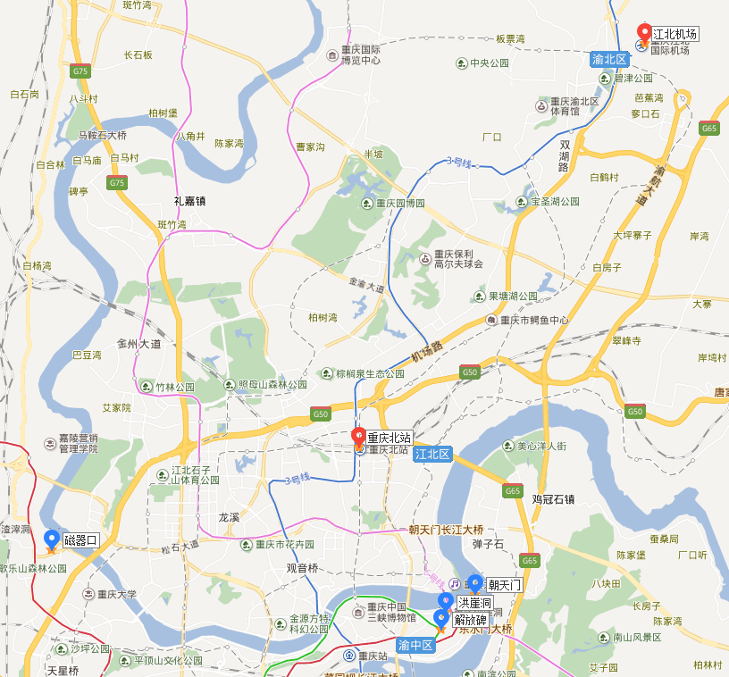

# 重庆
重庆成都靠得比较近，所以就一块儿去了。

## 交通
### 地图

### 往返程
出发时间 | 出发地 | 抵达时间 | 目的地 | 备注
---- | --- | --- | --- | ---
2017-8-20 17:35 | 南京 禄口机场T2 | 2017-8-20 19:55 | 重庆 [江北机场T2A](http://j.map.baidu.com/Q8grk) | 中国东方航空MU2845
2017-8-23 14:04 | 重庆 [重庆北](http://j.map.baidu.com/d9zvM) | 2017-8-23 15:45 | 成都 [成都东](http://j.map.baidu.com/w2LTC) | G8526
2017-8-25 12:50 | 成都 [成都东](http://j.map.baidu.com/w2LTC) | 2017-8-25 14:30 | 重庆 [重庆北](http://j.map.baidu.com/d9zvM) | G8515
2017-8-25 17:05 | 重庆 [江北机场T2B](http://j.map.baidu.com/Q8grk) | 2017-8-25 19:10 | 南京 禄口机场T2 | 西部航空PN6201
### 市内交通
地铁首末班车时间基本都是06:30-22:30

## 行程
### 时间安排
|    | 8-20 | 8-21  | 8-22   | 8-23
:--: | :--: | :---: | :---:  | :---:
上午 | -    | [朝天门](http://j.map.baidu.com/smJ9k) |        | 前往成都
下午 | -    | [解放碑](http://j.map.baidu.com/3B3D9) | [磁器口](http://j.map.baidu.com/js3D9) | -
晚上 | 抵达 | [洪崖洞](http://j.map.baidu.com/2_Vwk) |        | -
### 吃的
#### 解放碑
[八一路好吃街](http://you.ctrip.com/food/chongqing158/4926901.html) 山城小汤圆，王凉粉，重庆酸辣粉，糍粑，张鸭子，串串香，重庆小面

[吴抄手](http://you.ctrip.com/food/chongqing158/4926722.html) 夫妻肺片，川北凉粉，凉菜，口水鸡，锅贴，蒸饺，阳春面，糖醋排骨，蒜泥白肉，鸡汁锅贴，鸡丝凉面，抄手，灯影牛肉，怪味鸡，豆芽汤，鸡汤抄手，麻辣鸡，陈皮兔丁，红油抄手，番茄丸子汤，素椒面，金钩抄手，清汤抄手，红油金钩抄手，麻辣抄手

[花市豌杂面](http://you.ctrip.com/food/chongqing158/344272.html) 炸酱面，牛肉面，豆浆，杂酱面，碗杂面，抄手，红油抄手，小面，豌杂面，豌杂，清汤抄手，豌豆面，豌豆杂酱面，花市豌杂面，豌杂粉，碗杂小面，热门菜肴，碗杂，红烧肥肠面，素面，碗杂米线，唯怡豆奶，豌豆米粉

[好又来](http://you.ctrip.com/food/chongqing158/4926742.html) 胖子妈的串串香，凉粉和两面，凉粉，刨冰，水煮鱼，双皮奶，酸辣粉，麻婆豆腐，凉面，干锅，粉蒸牛肉，杂酱酸辣粉，抄手，凉糕，西瓜刨冰，炸酱酸辣粉，红豆刨冰，杂酱，杂酱芍皮，冰激凌刨冰，水果刨冰，什锦刨冰，小炒，手工凉皮

[齐齐火锅](http://you.ctrip.com/food/chongqing158/5415488.html)

#### 洪崖洞
[佬麻抄手](http://you.ctrip.com/food/chongqing158/5416120.html) 担担面，牛肉面，酸辣粉，杂酱面，杂酱酸辣粉，银耳汤，凉糕，小面，功夫面，佬麻抄手，中麻抄手，微麻抄手，原汁抄手，佬麻鸳鸯抄手，牛肉面线，麻抄手，稻香凉糕

[洪鼎美人美火锅](http://j.map.baidu.com/ZkE9j) 

#### 磁器口
[陈建平老街陈麻花](http://you.ctrip.com/food/chongqing158/344268.html) 陈麻花，椒盐麻花，甜麻花，麻辣麻花，椰奶麻花，冰糖糯米，冰糖糯米麻花，原味麻花，绿豆沙麻花，甜味麻花，麻辣椒盐麻花，椒盐麻辣，微辣麻花，咸麻花

#### 其他
[洞亭鲜火锅](http://j.map.baidu.com/AIm7B)

[板凳面庄](http://j.map.baidu.com/vHkdC)

[南山泉水鸡一条街](http://j.map.baidu.com/SFtkC)
